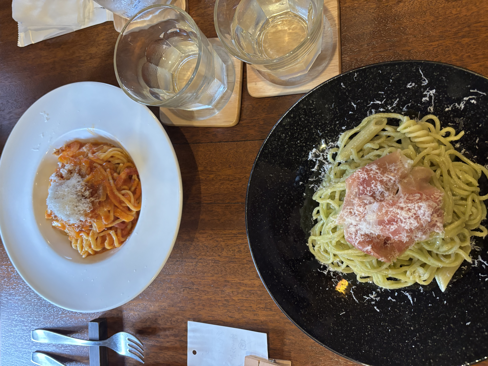

> ※この材料・作り方は写真と料理名からの推定です。実際に作って調整してください。

## 説明
黒い大皿にたっぷり盛られた、バジルソースを絡めた自家製の太めの生パスタ。上に生ハムをのせ、パルミジャーノをたっぷり削りかけた一皿。手前の小皿はトマトソースの生パスタ（別皿の少量サイズ）。もちもちの自家製麺が主役の店。

## 材料（2人分）
- 生パスタ（フェットチーネ〜太麺）: 200g
- 生ハム: 6〜8枚
- バジルの葉: 30g
- パルミジャーノ・レッジャーノ: 30g＋仕上げ用
- 松の実（またはカシューナッツ）: 15g
- にんにく: 1/2かけ
- エキストラバージンオリーブオイル: 60ml
- 塩: 適量
- 粗挽き黒こしょう: 適量

## 作り方
1. バジル、松の実、にんにく、パルミジャーノ、オリーブオイル、塩少々をミキサーで撹拌し、バジルソースを作る。
2. たっぷりの湯を沸かし、1%の塩を加えて生パスタを表示時間ゆでる。
3. ボウルにバジルソースと、ゆで汁を大さじ2ほど入れて混ぜる。
4. 湯を切ったパスタを加え、手早く和えて乳化させる。
5. 皿に盛り、生ハムをふんわりのせ、パルミジャーノと黒こしょうを削りかける。

## メモ・感想
（食べたときの感想をここに書く）

## 調整メモ
（実際に作ってみて気づいたことをここに追記する）
