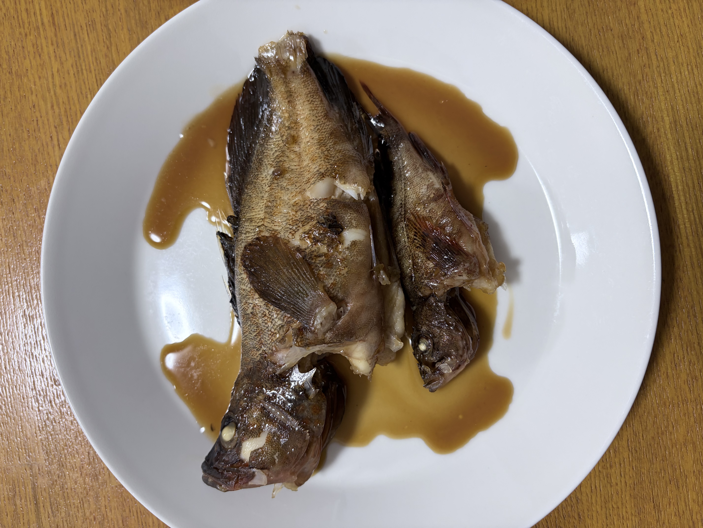

> ※この材料・作り方は写真と料理名からの推定です。実際に作って調整してください。

## 説明
白い皿に盛った、メバル（またはカサゴ）を丸ごと甘辛く炊いた煮付け。とろりとした照りのある煮汁が回りにたまり、身はふっくら。ごはんが進む、家庭の定番の魚料理。

## 材料（2人分）
- メバル（またはカサゴ・ソイ）: 2尾（内臓・うろこは処理済み）
- 水: 150ml
- 酒: 100ml
- しょうゆ: 大さじ3
- みりん: 大さじ3
- 砂糖: 大さじ1.5
- しょうが: 1かけ（薄切り）
- 長ねぎ（青い部分）: 1本分（あれば）

## 作り方
1. メバルは表面に飾り包丁を1本入れ、熱湯をさっと回しかけて霜降りにし、冷水で残ったうろこや血合いを洗う。
2. 平鍋に水・酒・しょうゆ・みりん・砂糖・しょうがを入れて煮立てる。
3. 煮立ったところに魚を並べ入れ、落としぶたをして中火で7〜8分煮る。
4. 落としぶたを外し、煮汁を魚にかけながら、とろみが出るまで4〜5分煮詰める。
5. 皿に盛り、煮汁をたっぷりかける。好みで針しょうがや白髪ねぎを添える。

## メモ・感想
（食べたときの感想をここに書く）

## 調整メモ
（実際に作ってみて気づいたことをここに追記する）
