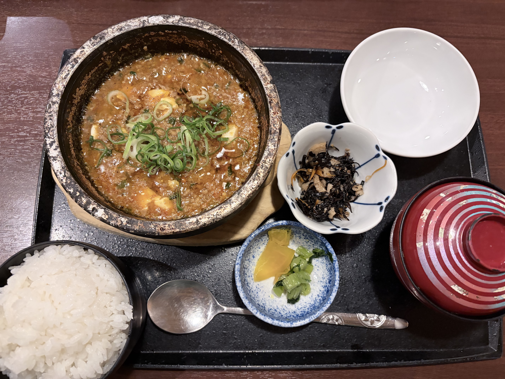

> ※この材料・作り方は写真と料理名からの推定です。実際に作って調整してください。

## 説明
熱々の石鍋でぐつぐつ煮立った状態で出てくる麻婆豆腐の定食。たっぷりの刻みねぎがのり、ひき肉と豆腐がとろみのある赤い麻婆あんにからむ。白米・ひじきの煮物・漬物・味噌汁つき。ラー油と花椒が効いたしびれ系。

## 材料（2人分）
- 木綿豆腐: 1丁（300g）
- 豚ひき肉: 120g
- 長ねぎ: 1/2本（みじん切り）
- にんにく・しょうが: 各1かけ（みじん切り）
- 豆板醤: 大さじ1
- 甜麺醤: 大さじ1
- 豆豉（あれば・刻む）: 小さじ1
- 鶏がらスープ: 200ml
- しょうゆ: 大さじ1
- 酒: 大さじ1
- 水溶き片栗粉: 片栗粉大さじ1＋水大さじ2
- ラー油・花椒（粉）: 各適量
- サラダ油: 大さじ2
- 小口ねぎ: 適量（仕上げ）

## 作り方
1. 豆腐は2cm角に切り、塩少々を入れた湯で2分ゆでて湯を切る（崩れ防止・水切り）。
2. フライパンに油を熱し、ひき肉を色が変わってやや香ばしくなるまで炒める。
3. にんにく・しょうが・豆板醤・甜麺醤・豆豉を加え、香りが立つまで弱火で炒める。
4. 鶏がらスープ、しょうゆ、酒を加え、豆腐を入れて2〜3分煮る。
5. みじん切りねぎを加え、水溶き片栗粉を回し入れてとろみをつける。
6. 強火で20〜30秒煮立ててツヤを出し、ラー油を回しかける。器（あれば土鍋）に盛り、花椒と小口ねぎを振る。

## メモ・感想
（食べたときの感想をここに書く）

## 調整メモ
（実際に作ってみて気づいたことをここに追記する）
