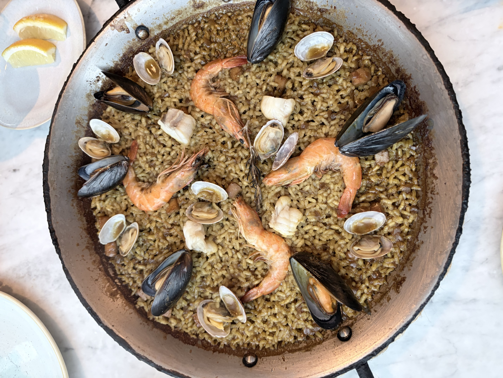

> ※この材料・作り方は写真と料理名からの推定です。実際に作って調整してください。

## 説明
海老、ムール貝、あさり、白身魚がたっぷりのったシーフードパエリア。魚介の旨みが染み込んだ香ばしいお焦げ（ソカラット）が魅力で、レモンを絞って爽やかに仕上げていただく一皿。

## 材料（2人分）
- 米（パエリア用または洗わない生米）: 150g
- 海老（殻付き）: 6尾
- ムール貝: 6個
- あさり: 8個
- 白身魚（タラや鯛など）: 100g
- 魚介だし（フュメ・ド・ポワソン）: 350ml
- 玉ねぎ: 1/2個（みじん切り）
- にんにく: 1片（みじん切り）
- トマト: 1個（すりおろし）
- サフラン: ひとつまみ
- オリーブオイル: 大さじ2
- 白ワイン: 50ml
- ローズマリー: 1枝
- レモン: 適量（くし切り）
- 塩・こしょう: 適量

## 作り方
1. 米は洗わずに使う。サフランは大さじ2の温水に浸しておく。
2. パエリア鍋にオリーブオイルを熱し、玉ねぎとにんにくを弱火で炒める。
3. すりおろしたトマトを加え、水分が飛ぶまで炒めてソフリートを作る。
4. 米を加えて油をまとわせるように軽く炒める。
5. 白ワイン、魚介だし、サフラン（浸し汁ごと）を加え、塩で味を調えて全体を混ぜたら、以降は混ぜずに中火で煮る。
6. 海老、ムール貝、あさり、白身魚、ローズマリーを彩りよく並べる。
7. 沸騰したら弱火にし、蓋をせず15〜18分ほど、水分がなくなり底にお焦げ（ソカラット）ができるまで加熱する。
8. 火を止めてアルミホイルをかぶせ5分ほど蒸らす。レモンを添えて完成。

## メモ・感想
（食べたときの感想をここに書く）

## 調整メモ
（実際に作ってみて気づいたことをここに追記する）
