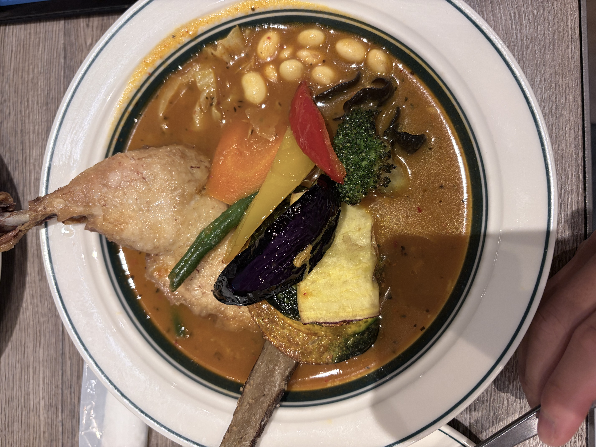

> ※この材料・作り方は写真と料理名からの推定です。実際に作って調整してください。

## 説明
札幌発祥のスープカレー。骨付きチキンレッグと、素揚げしたごろごろ野菜（なす・ブロッコリー・かぼちゃ・にんじん・パプリカ・いんげん・きのこ）を、さらさらのスパイススープに沈めた一皿。白いんげん豆入り。グランフロント大阪のスープカレー店で。

## 材料（2人分）
- 骨付き鶏もも肉（チキンレッグ）: 2本
- なす: 1本
- かぼちゃ: 1/8個
- ブロッコリー: 1/4株
- にんじん: 1/2本
- パプリカ（赤・黄）: 各1/4個
- いんげん: 4本
- しめじ・きくらげ: 適量
- 白いんげん豆（水煮）: 大さじ3
- 玉ねぎ: 1個（すりおろし）
- にんにく・しょうが: 各1かけ（すりおろし）
- トマト缶（カット）: 100g
- カレー粉: 大さじ2
- クミン・コリアンダー・ガラムマサラ: 各小さじ1/2
- 鶏がらスープ: 700ml
- ローリエ: 1枚
- サラダ油・揚げ油: 適量
- 塩: 小さじ1

## 作り方
1. チキンレッグは塩をすり込み、フライパンで皮目を香ばしく焼きつける。
2. 鍋に油を熱し、すりおろした玉ねぎ・にんにく・しょうがをあめ色になるまで炒める。
3. トマト、カレー粉、クミン、コリアンダーを加えて油となじむまで炒める。
4. 鶏がらスープ、ローリエ、焼いたチキンを入れ、弱火で40〜50分煮込む。
5. なす・かぼちゃ・にんじん・パプリカ・ブロッコリーは食べやすく切り、素揚げする。
6. スープに白いんげん豆を加えて塩で味を調え、仕上げにガラムマサラを振る。
7. 器にスープとチキンを盛り、素揚げ野菜ときのこを彩りよくのせる。

## メモ・感想
（食べたときの感想をここに書く）

## 調整メモ
（実際に作ってみて気づいたことをここに追記する）
