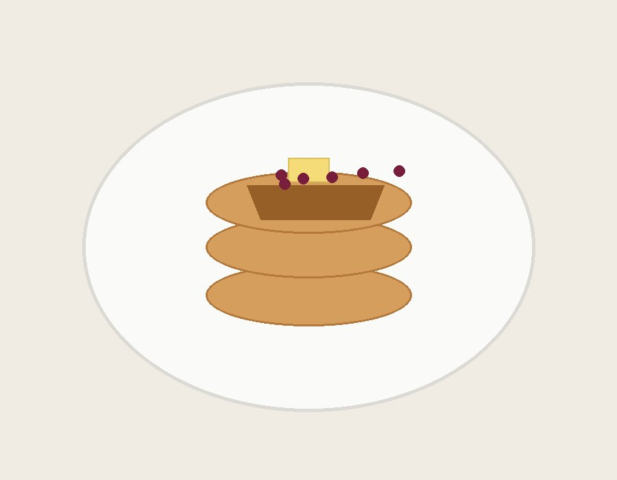

> ※この材料・作り方は写真と料理名からの推定です。実際に作って調整してください。

## 説明
バターとブルーベリーを添えた、ふんわり厚みのあるパンケーキの3段重ね。シンプルながらも表面はこんがり焼き色がつき、バターが溶けて染み込む素朴な一皿。

## 材料（2人分）
- 薄力粉: 200g
- ベーキングパウダー: 小さじ2
- 砂糖: 大さじ2
- 塩: ひとつまみ
- 卵: 2個
- 牛乳: 200ml
- 溶かしバター: 大さじ2
- 仕上げ用バター: 適量
- ブルーベリー: 適量

## 作り方
1. ボウルに薄力粉、ベーキングパウダー、砂糖、塩を入れて混ぜる。
2. 別のボウルで卵、牛乳、溶かしバターを混ぜ合わせる。
3. 粉類に卵液を加え、粉気が少し残る程度にさっくり混ぜる。
4. フライパンを弱火で熱し、生地を丸く流し入れ、表面に気泡が出てきたら裏返す。
5. 両面こんがり焼けたら重ねて盛り付け、バターとブルーベリーをのせて完成。

## メモ・感想
（食べたときの感想をここに書く）

## 調整メモ
（実際に作ってみて気づいたことをここに追記する）
