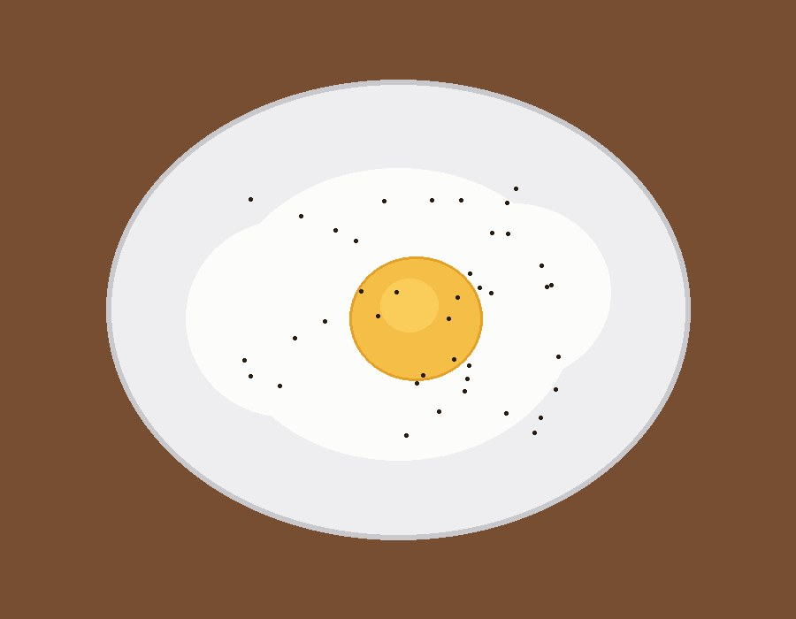

> ※この材料・作り方は写真と料理名からの推定です。実際に作って調整してください。

## 説明
自宅で作った定番の目玉焼き。白身がふんわり焼けていて、黄身は半熟気味。
シンプルに塩・こしょうで味付けした朝食の一品。

## 材料（2人分）
- 卵: 2個
- サラダ油またはバター: 小さじ2
- 塩: 少々
- こしょう: 少々
- 水（蒸し焼き用）: 大さじ1

## 作り方
1. フライパンを中火で熱し、油またはバターを引く。
2. 卵を静かに割り入れる。
3. 白身の縁が固まってきたら弱火にし、水を加えてふたをする。
4. 黄身が好みの固さになるまで1〜2分蒸し焼きにする。
5. 塩・こしょうを振って皿に盛る。

## メモ・感想
（食べたときの感想をここに書く）

## 調整メモ
（実際に作ってみて気づいたことをここに追記する）
